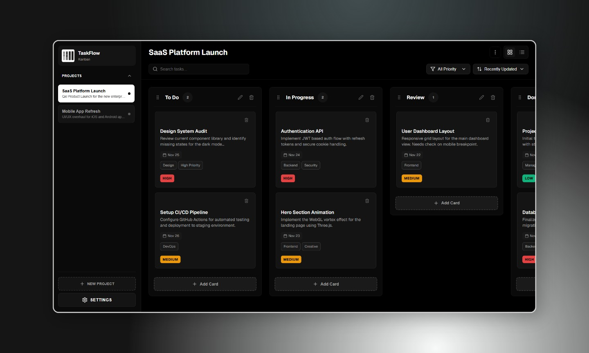

# TaskFlow



<div align="center">

[](https://react.dev/)
[](https://vitejs.dev/)
[](LICENSE)

**A beautiful, fast, and intuitive Kanban board application for managing your projects and tasks.**

[View Demo](#) · [Report Bug](#) · [Request Feature](#)

</div>

---

## 🚀 Overview

**TaskFlow** is a modern project management tool designed for speed and simplicity. Built with **React 19** and **Vite**, it offers a seamless drag-and-drop experience, local-first data persistence, and a stunning "Cinematic" dark mode interface. Whether you're managing a personal project or a team sprint, TaskFlow helps you focus on what matters.

## ✨ Key Features

- **🎨 Cinematic UI**: A premium, monochromatic "Blackmatter" aesthetic with glassmorphism effects and smooth animations.
- **🎯 Drag-and-Drop**: Powered by `@dnd-kit` for buttery smooth task management across lanes.
- **📊 Multiple Projects**: Manage unlimited projects with isolated boards and states.
- **🌓 Dark/Light Mode**: Fully responsive themes that adapt to your preference.
- **💾 Local-First**: All data is persisted locally using `localStorage`—no account required, zero latency.
- **📱 Fully Responsive**: Optimized for desktop, tablet, and mobile devices.
- **📤 Import/Export**: Full JSON backup and restore functionality to keep your data safe.
- **⚡ High Performance**: Built on Vite for instant load times and reactive interactions.

## 🛠️ Tech Stack

- **Framework**: [React 19](https://react.dev/)
- **Build Tool**: [Vite](https://vitejs.dev/)
- **Drag & Drop**: [@dnd-kit/core](https://dndkit.com/)
- **Icons**: [Lucide React](https://lucide.dev/)
- **Styling**: CSS Modules with modern CSS variables
- **State Management**: React Hooks & Context
- **Routing**: React Router DOM

## 🏁 Getting Started

Follow these steps to get a local copy up and running.

### Prerequisites

- Node.js (v16 or higher)
- npm or yarn

### Installation

1.  **Clone the repository**
    ```bash
    git clone https://github.com/mosaddiqdev/TaskFlow.git
    cd taskflow
    ```

2.  **Install dependencies**
    ```bash
    npm install
    ```

3.  **Start the development server**
    ```bash
    npm run dev
    ```

4.  **Build for production**
    ```bash
    npm run build
    ```

## 📂 Project Structure

```
src/
├── components/      # Reusable UI components (Board, Card, Hero, etc.)
├── hooks/           # Custom React hooks (useLocalStorage, etc.)
├── pages/           # Page components (LandingPage, Dashboard)
├── utils/           # Helper functions (storage, validation)
├── App.jsx          # Main application entry
└── main.jsx         # React DOM root
```

## 🎯 Features in Detail

### Landing Page
- Interactive 3D showcase with mouse-responsive tilt effect
- Glassmorphism "Enter Workspace" button
- macOS-style window controls
- Subtle grid background pattern

### Kanban Board
- Smooth drag-and-drop between lanes
- Card duplication and editing
- Priority levels and due dates
- Label management

## 🤝 Contributing

Contributions are what make the open source community such an amazing place to learn, inspire, and create. Any contributions you make are **greatly appreciated**.

1.  Fork the Project
2.  Create your Feature Branch (`git checkout -b feature/AmazingFeature`)
3.  Commit your Changes (`git commit -m 'Add some AmazingFeature'`)
4.  Push to the Branch (`git push origin feature/AmazingFeature`)
5.  Open a Pull Request

## 📄 License

Distributed under the MIT License. See `LICENSE` for more information.

---

<div align="center">
  <p>Built with ❤️ by TaskFlow Team</p>
</div>
